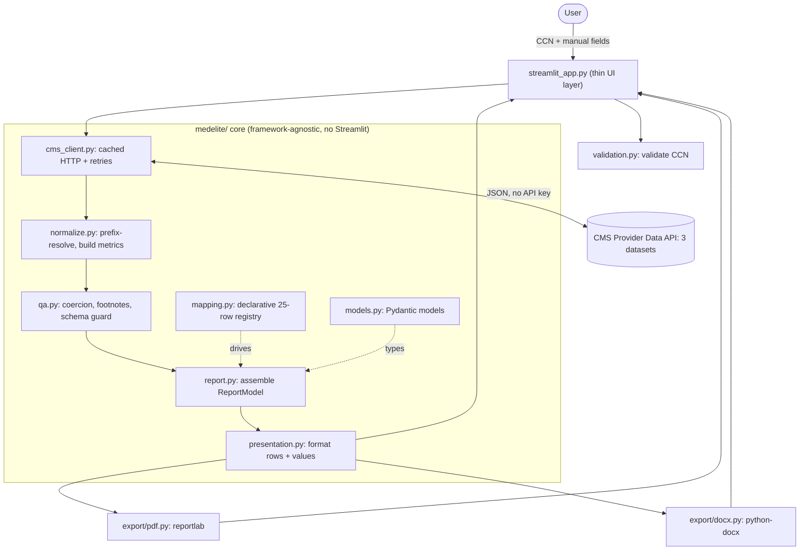
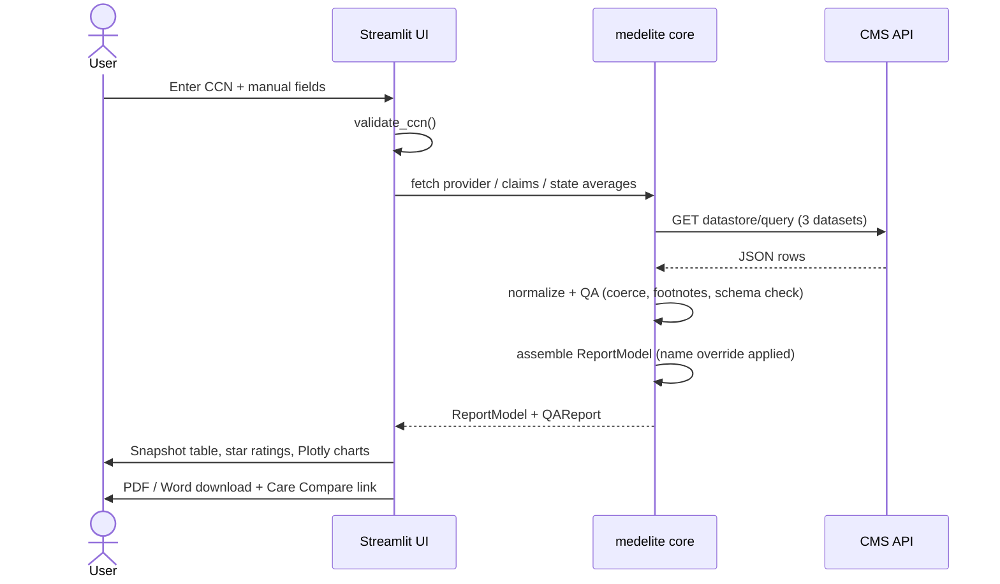

<div align="center">

# 🏥 Facility Assessment Report Generator

**Turn a CMS Certification Number into a branded, export-ready facility snapshot — in seconds.**

A lightweight micro-app that pulls live CMS nursing-home data for any facility, merges it with manual operational fields, and renders a polished **Facility Assessment Snapshot** with one-click **PDF** and **Word** export — plus a side-by-side **compare mode** for evaluating several facilities at once.

### ▶ Live app: **https://medelite-facility-report.streamlit.app**

[](https://medelite-facility-report.streamlit.app)
[](https://github.com/deep25lelouch/medelite-facility-report/actions/workflows/ci.yml)


[Poetry](https://img.shields.io/badge/Poetry-60A5FA?logo=poetry&logoColor=white)


</div>

<!-- Add a screenshot: save a capture of the running app to docs/screenshot.png and uncomment the block below.
<p align="center"></p>
-->

---

## Overview

Care organizations evaluating a nursing facility need a fast, trustworthy one-page profile that blends **public CMS quality data** with their own **operational notes**. This app does exactly that: enter a 6-digit **CMS Certification Number (CCN)**, and it fetches the facility's official ratings, bed count, location, and hospitalization/ED measures directly from the CMS Provider Data Catalog, layers in manually entered fields (EMR, census, coverage, etc.), and produces a branded snapshot you can read on screen or download as a PDF or Word document.

The design priority is **data quality**: every value from CMS is validated and coerced through a QA layer that decodes official footnotes, flags schema drift, and clearly marks anything missing as `N/A` with the reason — never a silent blank or a wrong number.

The app runs in **two modes**: a detailed single-facility snapshot, and a **compare** mode that places several facilities side by side for partnership decisions.

---

## Features

**Core**
- 🔎 **Live CMS lookup** by CCN against the public Provider Data API (no API key required).
- 📝 **Manual field merge** — EMR, current census, patient type, prior coverage/performance, medical coverage, and a facility-name override.
- 🧾 **25-row Facility Assessment Snapshot** with the hardcoded `INFINITE · Managed by MEDELITE` brand header.
- 🛡️ **QA layer** — validated coercion, footnote-aware `N/A`, out-of-range rejection, and a schema-drift guard that fails loud if CMS renames a column.
- 📄 **PDF export** with a clickable Medicare Care Compare link.

**Bonus**
- 📊 **12 hospitalization & ED metrics** — short-stay rehospitalization/ED and long-stay hospitalization/ED, each compared against **national and state** benchmarks (pulled from two additional CMS datasets).
- 📈 **Interactive Plotly charts** + delta data-cards (facility vs U.S. average, color-coded so *lower = better*).
- 🆚 **Compare mode** — paste multiple CCNs to evaluate facilities side by side: a comparison table, grouped **star-rating** and **hospitalization/ED outcome** charts (each vs the U.S. average), per-facility Care Compare links, and **CSV / PDF** export of the comparison.
- 📃 **Word (.docx) export** mirroring the snapshot, with a real clickable hyperlink.
- ⭐ **Star-rating glyphs** and a sectioned table separating the profile block from the metrics block.
- ✅ **CCN format validation** and friendly error states for not-found / API-down cases.
- 🧪 **~39 tests** including **Hypothesis** property-based tests that caught a real edge-case bug, run in **CI** on every push.

---

## Architecture

A deliberately thin Streamlit UI sits on top of a **framework-agnostic core** (`medelite/`) that contains **zero Streamlit imports** — so the same logic is unit-testable and could be lifted behind a REST API unchanged. A single declarative field registry (`mapping.py`) is the source of truth for the layout, and one `ReportModel` feeds **three renderers** (on-screen table, PDF, Word).



### Request lifecycle



---

## Data sources

All data comes from the public **CMS Provider Data Catalog** (`data.cms.gov`) — no API key, no rate limits. Fetches happen **server-side**, so there are no browser CORS issues.

| Dataset | ID | Used for |
| --- | --- | --- |
| Provider Information | `4pq5-n9py` | Star ratings, certified beds, address, legal name |
| Medicare Claims Quality Measures | `ijh5-nb2v` | Facility hospitalization & ED rates |
| Provider Data — State / US Averages | `xcdc-v8bm` | National and per-state benchmark values |

Query pattern (single facility):

```
GET https://data.cms.gov/provider-data/api/1/datastore/query/{datasetId}/0
    ?conditions[0][property]=cms_certification_number_ccn
    &conditions[0][value]={ccn}
    &conditions[0][operator]==
```

CMS truncates and hash-suffixes long column names, so the core resolves fields by **stable prefix** rather than hardcoding the volatile suffix.

---

## Project structure

```
medelite-facility-report/
├─ streamlit_app.py            # UI entry point (only file importing Streamlit)
├─ medelite/                   # framework-agnostic core (no Streamlit imports)
│  ├─ config.py                # API base, dataset IDs, brand constants
│  ├─ mapping.py               # declarative 25-row field + metric registry
│  ├─ models.py                # Pydantic models (ReportModel, QAReport, ...)
│  ├─ cms_client.py            # cached CMS HTTP client + retries
│  ├─ normalize.py             # slug prefix-resolution, metric assembly
│  ├─ qa.py                    # validated coercion, footnotes, schema guard
│  ├─ report.py                # assemble_report() / build_report()
│  ├─ presentation.py          # row + value formatting (shared by all renderers)
│  ├─ validation.py            # CCN validation + multi-CCN parsing
│  └─ export/
│     ├─ pdf.py                # reportlab PDF renderer (single facility)
│     ├─ compare_pdf.py        # reportlab PDF renderer (side-by-side comparison)
│     └─ docx.py               # python-docx Word renderer
├─ tests/                      # ~39 tests (pytest + Hypothesis)
├─ scripts/verify.py           # live CMS dataset/slug verifier
├─ .github/workflows/ci.yml    # CI: ruff + pytest on every push
├─ .streamlit/config.toml      # theme (magenta primary) + file-watcher setting
├─ requirements.txt            # runtime deps (used by Streamlit Community Cloud)
├─ pyproject.toml              # Poetry config + dependencies (local dev)
├─ poetry.lock
└─ README.md
```

---

## Getting started

**Requirements:** Python 3.11+ and [Poetry](https://python-poetry.org/).

```bash
git clone https://github.com/deep25lelouch/medelite-facility-report.git
cd medelite-facility-report
poetry install
poetry run streamlit run streamlit_app.py
```

Open the local URL Streamlit prints, then enter a CCN in the sidebar — try **`686123`** (Kendall Lakes Healthcare and Rehab Center, Miami FL). Switch to **Compare facilities** in the sidebar to paste several CCNs at once. Don't have a CCN handy? Each mode has a **Look up a CCN on Medicare** button that opens Care Compare.

> Need more facilities to test? `scripts/verify.py` (and the `find_test_ccns.py` helper) list real CCNs straight from the CMS dataset, filterable by state and rating.

---

## Testing & CI

```bash
poetry run pytest -q       # ~39 tests, including property-based tests
poetry run ruff check .    # lint
```

The suite covers value coercion and footnote handling, slug prefix-resolution, metric mapping, CCN validation/parsing, the not-found path, and the PDF/Word byte output. **Hypothesis** property tests fuzz the coercion layer — one of them surfaced an `OverflowError` from `int(float("inf"))`, now fixed with a finite-value guard and locked by a regression test.

A **GitHub Actions** workflow (`.github/workflows/ci.yml`) installs the project with Poetry and runs `ruff` + the full `pytest` suite on every push and pull request. (Ruff is non-blocking initially; flip `continue-on-error` off once `ruff check .` is clean locally to make lint gate the build too.)

---

## Deployment (Streamlit Community Cloud)

Deployed from this repo's `main` branch with `streamlit_app.py` as the entry point. Streamlit Community Cloud installs runtime dependencies from `requirements.txt`.

> ⏰ The free tier **sleeps** after inactivity — open the live URL a minute before a demo so it's warm.

**Scale path (if Medelite evaluated many facilities at once):** schedule a monthly **Airflow** job to snapshot the CMS datasets into **Postgres/Snowflake**, and point the app at the warehouse instead of the live API — caching benchmarks and enabling cross-facility comparison. Intentionally *not* built here, since the brief is a single-facility report generator and added infrastructure would over-scope it.

---

## Design decisions & tradeoffs

**Lightweight by intent.** Streamlit + a small typed core, no database, no API gateway. The brief is a 4–6 hour report micro-app, so the value is in clean data handling and a faithful layout — not infrastructure. Server-side fetching sidesteps CORS, and `pandas`/`pydantic` give a strong validation story.

**Override logic.** Facility name resolves as **override → CMS legal name → "Unknown Facility"**. Manual operational fields are merged on top of CMS-derived values. The `INFINITE` brand banner is a **fixed constant**, never derived from the facility name.

**QA / data-sourcing strategy.** Three CMS datasets, fetched server-side and cached. Every value passes through validated coercion that: decodes official **footnote codes** (e.g. "not enough data") into a readable `N/A` reason, rejects out-of-range or non-finite values, and runs a **schema-drift check** so a renamed CMS column fails loudly instead of silently nulling. Claims measures use `adjusted_score` with an `observed_score` fallback.

**Assumptions.** CMS refreshes monthly, so **live data legitimately differs from the static sample PDF** — the sample is treated as a *layout* reference, not a data target. Short-stay measures are stored as percentages (e.g. `25.6`), long-stay measures as rates per 1,000 resident-days. Star glyphs render on screen; the PDF/Word exports keep numeric ratings for print-font safety.

> These four themes map directly to the case-study questionnaire (Tech Stack & Override Logic · Data Sourcing & QA · Obstacles & Tradeoffs · Assumptions).

---

## Tech stack

`Python 3.11` · `Streamlit` · `Pydantic v2` · `requests` · `pandas` · `Plotly` · `reportlab` (PDF) · `python-docx` (Word) · `pytest` + `Hypothesis` · `ruff` · `Poetry` · `GitHub Actions`

---

<div align="center">

Built by **Deep Prajapati** for the Medelite *Healthcare Data Automation & QA Analytics* technical case study.

</div>
